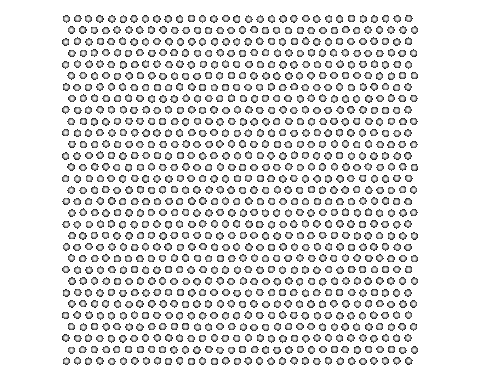

# Molecular Dynamics

## Features and implementation details

- 3D/2D particle simulations
- Output VTK files
- Periodic boundary conditions
- Temperature preserving velocity scaling
- Lennard-Jones potential
- Velocity-Verlet
- Linked list cell
- TBB parallelization over non-adjacent cells

## Examples

> End-frame of 3d simulation 

> Full animation of 2d simulation
